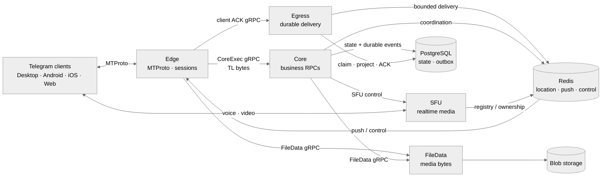

# gramsrv

**Own the server. Speak MTProto. Use real Telegram clients.**

`gramsrv` is an open-source Telegram-compatible server and MTProto backend
written in Go. It is built for self-hosted networks, protocol research, and
community-driven chat systems that need real client compatibility—not just a
Telegram-like interface.

[Website](https://telesrv.net) · [OwpenGram client](https://owpengram.org/) · [Discussion group](https://t.me/telesrv_chat) · [Channel](https://t.me/telesrv) · [中文 README](README.zh-CN.md) · [Русский README](README.ru.md)

<p align="center">
  
  
</p>

## Quick start with Docker

Both [`main`](../../tree/main) and [`v2`](../../tree/v2) now provide the same
one-command Docker entry point. `main` runs the monolithic server plus Admin;
`v2` runs the split Edge/Core/Egress/File/SFU topology. Install Git and Docker
Desktop, switch Docker Desktop to Linux containers, start it, and run in
PowerShell 5.1 or later:

```powershell
git clone --branch main --single-branch https://github.com/iamxvbaba/gramsrv.git
Set-Location gramsrv
.\scripts\start-docker.ps1
```

That is all a local first run needs. The script creates the deployment
environment, anonymously pulls the ready-to-run images from GHCR, starts every
service in dependency order, and waits until the stack is ready. No local Go
toolchain, PostgreSQL, Redis, image build, or `docker login` is required. Clone
`v2` instead of `main` in the command above when you want the microservice
deployment.

- The development login code is **`12345`**.
- Zero-argument startup listens only on `127.0.0.1` for a client on the same
  computer.
- The matching [public test key](deploy/docker/assets/test-server-rsa.pub) is
  included on both branches for compatible test clients.
- Accounts, database state, media, Redis state, and the RSA identity use Docker
  named volumes and survive container recreation and normal Compose shutdown.
- Run without `-Build` to use the published images; `-Build` is only for local
  source changes.

If Windows blocks PowerShell scripts, allow them only for the current window
and retry:

```powershell
Set-ExecutionPolicy -Scope Process Bypass
.\scripts\start-docker.ps1
```

For a temporary LAN experience, replace the example address with the Windows
host's LAN address:

```powershell
.\scripts\start-docker.ps1 `
  -AdvertiseIP 192.168.1.20 `
  -PublicBaseURL http://192.168.1.20:2401 `
  -PublicWebBaseURL http://192.168.1.20:2401 `
  -AllowInsecureDevelopmentAuth
```

Stock Telegram clients require an endpoint and RSA-key patch. Use a compatible
client from the [project website](https://telesrv.net). On `main`, the monolith
uses host networking by default for SFU/TURN; pass `-BridgeNetwork` only when
host networking is unavailable. The [`v2` Docker deployment runbook](../../blob/v2/docs/docker-deployment.en.md)
covers the split topology, firewall, backup, upgrade, and remote access.

## Why gramsrv

Most Telegram clones reproduce the interface. `gramsrv` implements the server
side of the protocol so compatible clients can communicate through
infrastructure you control.

- Real MTProto transport, authentication, encrypted sessions, RPC dispatch,
  updates, and multi-device synchronization.
- A practical feature surface covering chats, channels, media, reactions,
  gifts, bots, calls, and administration.
- Open server code from the protocol edge to business services, storage, and
  realtime media.
- A Go codebase designed for compatibility work, experimentation, and
  long-term community development.

The protocol stack is built on the published
[`github.com/iamxvbaba/td`](https://github.com/iamxvbaba/td) module and follows
current Telegram Desktop wire behavior.

## Choose your architecture

| Branch | Architecture | Best fit |
|---|---|---|
| [`main`](../../tree/main) | Monolith | A straightforward single-process server for development, evaluation, and smaller deployments. |
| [`v2`](../../tree/v2) | Microservices | A split runtime with independent service boundaries for scaling, reliability, and production-oriented operation. |

## Validated performance

Recent optimization work has focused on bounded concurrency, durable delivery,
and descriptor-backed file transfer. The latest successful real-client load
tests produced the following results:

| Scenario | Validated result | Server-side metrics |
|---|---|---|
| `main` sustained concurrency | 10,000 online sessions; 309,349 successful operations; no reconnects or fatal errors | 1.64 GB peak heap; 30,528 peak goroutines; 48/50 peak PostgreSQL connections |
| `main` account startup | 1,000/1,000 accounts ready; 314 ms average readiness | 904.5 MB peak heap; 509 peak goroutines; 8/50 peak PostgreSQL connections |
| `v2` private messaging | 1,000 accounts at 1,000 messages/s; 59,211/59,211 delivered live; no loss or duplication | 1.75 s end-to-end p99; durable delivery queues returned to zero |
| `main` 2,000-member mixed-file test | 20,000/20,000 downloads; 1,226.85 MiB/s | 516.9 MB peak heap, 17.1% below the previous validated run |
| `v2` 2,000-member mixed-file test | 20,000/20,000 downloads; 840.92 MiB/s | 552.4 MB Edge peak heap allocation; 894,928 KiB peak RSS; 14.9% lower RSS; zero PostgreSQL connection rejections |

After the validation recovery windows, sessions, tracked buffers, receipts,
delivery queues, and durable delivery state returned to zero. The file-specific
optimizations do not change normal text-message protocol or delivery behavior.

These are single-host development-environment capacity results, not production
multi-host service-level guarantees. In particular, the 10,000-session result
applies to `main`; higher-scale `v2` account tests remain in progress.

## v2 at a glance



Connections stay at the Edge, business execution stays in Core, and reliable
delivery remains durable through Egress.

## What works today

- Accounts, contacts, profiles, privacy, presence, and multiple sessions.
- Private chats, groups, supergroups, channels, topics, invites, and public
  links.
- Durable updates, dialogs, read state, drafts, reactions, offline recovery,
  and multi-device synchronization.
- Photos, documents, stickers, GIFs, voice messages, previews, uploads, and
  downloads.
- Gifts and Stars, Premium flows, bots and mini apps, translation, and AI
  compose integrations.
- Private-call signaling, group calls, RTMP live streams, and standalone SFU
  ownership.

Telegram Desktop is the primary compatibility target. Android, iOS, and Web
client paths are also actively covered. Some advanced features remain
compatibility-first or experimental, but the implementation is open in this
repository.

## Clients

Stock Telegram clients trust Telegram's production data centers and RSA keys,
so they do not connect to private servers without a small endpoint and key
patch. Use a compatible client from the [project website](https://telesrv.net)
or build your own patched client.

[OwpenGram](https://owpengram.org/) is a multi-server Telegram-style client
with built-in support for `gramsrv`, private deployments, community nodes, and
the official network from one client experience.

## Build it with us

Compatibility reports, focused fixes, tests, and performance work are welcome.
The most useful reports include the client version, reproducible steps, and the
affected RPC or feature path.

Contributor: [ajarshia](https://github.com/ajarshia) — Android Persian (`fa`)
language pack.

## License and independence

`gramsrv` is released under the [Apache License 2.0](LICENSE). It is independent
and unofficial, and is not affiliated with, endorsed by, or sponsored by
Telegram or its official team.
