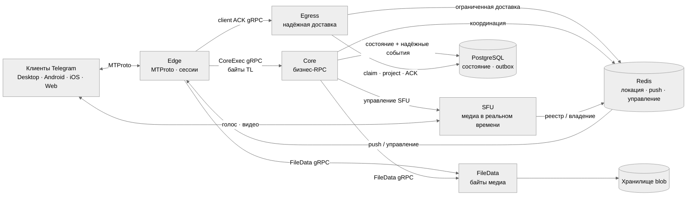

# ShuzaGram

**Владей сервером. Говори на MTProto. Используй настоящие клиенты Telegram.**

`ShuzaGram` — это открытый совместимый с Telegram сервер и бэкенд MTProto,
написанный на Go. Он создан для самостоятельно размещаемых сетей,
исследования протокола и сообществ, которым нужна настоящая совместимость с
клиентами — а не просто интерфейс, похожий на Telegram.

[Website](https://telesrv.net) · [Клиент OwpenGram](https://owpengram.org/) · [Группа обсуждения](https://t.me/telesrv_chat) · [Канал](https://t.me/telesrv) · [中文 README](README.zh-CN.md)

<p align="center">
  
  
</p>

## Быстрый старт с Docker

И [`main`](../../tree/main), и [`v2`](../../tree/v2) теперь предоставляют одну
и ту же точку входа в одну команду через Docker. `main` запускает
монолитный сервер плюс Admin; `v2` запускает разделённую топологию
Edge/Core/Egress/File/SFU. Установи Git и Docker Desktop, переключи Docker
Desktop на Linux-контейнеры, запусти его и выполни в PowerShell 5.1 или
новее:

```powershell
git clone --branch main --single-branch https://github.com/iamxvbaba/gramsrv.git
Set-Location gramsrv
.\scripts\start-docker.ps1
```

Это всё, что нужно для первого локального запуска. Скрипт создаёт окружение
для развёртывания, анонимно скачивает готовые к запуску образы из GHCR,
запускает все сервисы в правильном порядке зависимостей и ждёт готовности
стека. Не требуется ни локальный набор инструментов Go, ни PostgreSQL, ни
Redis, ни сборка образов, ни `docker login`. Клонируй `v2` вместо `main` в
команде выше, если хочешь развёртывание в виде микросервисов.

- Код входа для разработки — **`12345`**.
- Запуск без аргументов слушает только `127.0.0.1` — для клиента на этом же
  компьютере.
- Соответствующий [публичный тестовый ключ](deploy/docker/assets/test-server-rsa.pub)
  включён в обе ветки для совместимых тестовых клиентов.
- Аккаунты, состояние базы данных, медиа, состояние Redis и RSA-идентичность
  хранятся в именованных томах Docker и переживают пересоздание контейнера и
  обычную остановку Compose.
- Запускай без `-Build`, чтобы использовать опубликованные образы; `-Build`
  нужен только при локальных изменениях исходного кода.

Если Windows блокирует скрипты PowerShell, разреши их только для текущего
окна и повтори попытку:

```powershell
Set-ExecutionPolicy -Scope Process Bypass
.\scripts\start-docker.ps1
```

Для временного доступа по локальной сети замени пример адреса на LAN-адрес
хоста Windows:

```powershell
.\scripts\start-docker.ps1 `
  -AdvertiseIP 192.168.1.20 `
  -PublicBaseURL http://192.168.1.20:2401 `
  -PublicWebBaseURL http://192.168.1.20:2401 `
  -AllowInsecureDevelopmentAuth
```

Стоковым клиентам Telegram нужны эндпоинт и патч RSA-ключа. Используй
совместимый клиент с [сайта проекта](https://telesrv.net). В `main` монолит
по умолчанию использует host networking для SFU/TURN; передавай
`-BridgeNetwork` только если host networking недоступен. [Руководство по
развёртыванию `v2` в Docker](../../blob/v2/docs/docker-deployment.en.md)
охватывает разделённую топологию, файрвол, бэкапы, обновление и удалённый
доступ.

## Почему ShuzaGram

Большинство клонов Telegram воспроизводят интерфейс. `ShuzaGram` реализует
серверную сторону протокола, чтобы совместимые клиенты могли общаться через
инфраструктуру, которую контролируешь ты.

- Настоящий транспорт MTProto, аутентификация, зашифрованные сессии,
  диспетчеризация RPC, обновления и синхронизация между несколькими
  устройствами.
- Практичный набор функций: чаты, каналы, медиа, реакции, подарки, боты,
  звонки и администрирование.
- Открытый серверный код — от края протокола до бизнес-сервисов, хранилища
  и медиа в реальном времени.
- Кодовая база на Go, спроектированная для работы над совместимостью,
  экспериментов и долгосрочного развития сообществом.

Стек протокола построен на опубликованном модуле
[`github.com/iamxvbaba/td`](https://github.com/iamxvbaba/td) и следует
текущему поведению провода Telegram Desktop.

## Выбери свою архитектуру

| Ветка | Архитектура | Для чего подходит |
|---|---|---|
| [`main`](../../tree/main) | Монолит | Простой однопроцессный сервер для разработки, оценки и небольших развёртываний. |
| [`v2`](../../tree/v2) | Микросервисы | Разделённая среда выполнения с независимыми границами сервисов — для масштабирования, надёжности и продакшн-эксплуатации. |

## Проверенная производительность

Недавняя оптимизация была сосредоточена на ограниченной конкурентности,
надёжной доставке и передаче файлов на основе дескрипторов. Последние
успешные нагрузочные тесты с реальными клиентами дали следующие результаты:

| Сценарий | Проверенный результат | Метрики на стороне сервера |
|---|---|---|
| `main`, устойчивая конкурентность | 10 000 онлайн-сессий; 309 349 успешных операций; без переподключений и фатальных ошибок | пик heap 1.64 ГБ; пик 30 528 горутин; пик 48/50 соединений PostgreSQL |
| `main`, запуск аккаунтов | 1 000/1 000 аккаунтов готовы; в среднем 314 мс до готовности | пик heap 904.5 МБ; пик 509 горутин; пик 8/50 соединений PostgreSQL |
| `v2`, приватные сообщения | 1 000 аккаунтов по 1 000 сообщений/с; доставлено вживую 59 211/59 211; без потерь и дублирования | p99 сквозной задержки 1.75 с; очереди надёжной доставки вернулись к нулю |
| `main`, тест на 2 000 участников со смешанными файлами | 20 000/20 000 загрузок; 1 226.85 МиБ/с | пик heap 516.9 МБ, на 17.1% ниже предыдущего проверенного запуска |
| `v2`, тест на 2 000 участников со смешанными файлами | 20 000/20 000 загрузок; 840.92 МиБ/с | пик heap Edge 552.4 МБ; пик RSS 894 928 КиБ; RSS на 14.9% ниже; ноль отказов соединений PostgreSQL |

После окон восстановления после проверки сессии, отслеживаемые буферы,
квитанции, очереди доставки и состояние надёжной доставки вернулись к нулю.
Оптимизации, специфичные для файлов, не меняют обычное поведение протокола
текстовых сообщений или доставки.

Это результаты ёмкости на одном хосте в среде разработки, а не гарантии
уровня обслуживания для продакшн-развёртывания на нескольких хостах. В
частности, результат с 10 000 сессиями относится к `main`; тесты аккаунтов
`v2` большего масштаба всё ещё продолжаются.

## v2 в общих чертах



Соединения остаются на Edge, бизнес-выполнение остаётся в Core, а надёжная
доставка остаётся стабильной через Egress.

## Что работает уже сейчас

- Аккаунты, контакты, профили, приватность, присутствие и несколько сессий.
- Приватные чаты, группы, супергруппы, каналы, темы, приглашения и
  публичные ссылки.
- Надёжные обновления, диалоги, статус прочтения, черновики, реакции,
  восстановление офлайн-состояния и синхронизация между устройствами.
- Фото, документы, стикеры, GIF, голосовые сообщения, превью, загрузка и
  скачивание.
- Подарки и Stars, потоки Premium, боты и мини-приложения, перевод и
  интеграции с AI compose.
- Сигнализация приватных звонков, групповые звонки, RTMP-трансляции и
  автономное владение SFU.

Telegram Desktop — основная цель совместимости. Пути клиентов Android, iOS
и Web также активно покрываются. Некоторые продвинутые функции остаются на
уровне «совместимость в приоритете» или экспериментальными, но реализация
открыта в этом репозитории.

## Клиенты

Стоковые клиенты Telegram доверяют продакшн-дата-центрам и RSA-ключам
Telegram, поэтому они не подключаются к приватным серверам без небольшого
патча эндпоинта и ключа. Используй совместимый клиент с [сайта
проекта](https://telesrv.net) или собери свой патченый клиент.

[OwpenGram](https://owpengram.org/) — это клиент в стиле Telegram с
поддержкой нескольких серверов, со встроенной поддержкой `ShuzaGram`,
приватных развёртываний, узлов сообщества и официальной сети в рамках
одного клиентского опыта.

## Развивай проект вместе с нами

Отчёты о совместимости, точечные исправления, тесты и работа над
производительностью — приветствуются. Самые полезные отчёты включают
версию клиента, воспроизводимые шаги и затронутый RPC или функцию.

Контрибьютор: [ajarshia](https://github.com/ajarshia) — языковой пакет для
персидского (`fa`) на Android.

## Лицензия и независимость

`ShuzaGram` распространяется под лицензией [Apache License 2.0](LICENSE). Он
независим и неофициален, не аффилирован с Telegram или его официальной
командой, не одобрен и не спонсируется ими.
