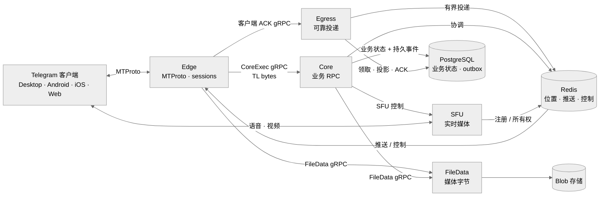

# gramsrv

**掌控服务器，使用 MTProto，连接真正的 Telegram 客户端。**

`gramsrv` 是一个用 Go 编写的开源 Telegram 兼容服务器和 MTProto 后端，
面向自主部署网络、协议研究，以及需要真实客户端兼容能力的社区聊天系统——
它不只是一个相似的聊天界面。

[English README](README.md) · [官网](https://shuzagram.com) · [OwpenGram 客户端](https://owpengram.org/) · [讨论群](https://t.me/+GcuQY963kRMwYzIy) · [频道](https://t.me/shuzagram)

<p align="center">
  
  
</p>

## Docker 一键体验

[`main`](../../tree/main) 和 [`v2`](../../tree/v2) 现在都提供同一个一行启动入口：
`main` 启动单体服务器和 Admin，`v2` 启动拆分后的 Edge/Core/Egress/File/SFU
拓扑。先安装 Git 和 Docker Desktop，把 Docker Desktop 切换到 Linux containers
并启动，然后在 PowerShell 5.1 或更高版本中执行：

```powershell
git clone --branch main --single-branch https://github.com/iamxvbaba/gramsrv.git
Set-Location gramsrv
.\scripts\start-docker.ps1
```

本机首次体验只需要这些命令。脚本会自动生成部署环境，无需登录即可从 GHCR 拉取当前
分支的现成镜像，按照依赖顺序启动全部服务并等待就绪。用户不需要安装 Go、PostgreSQL
或 Redis，也不需要本地构建镜像或执行 `docker login`。需要微服务部署时，把上面命令
中的 `main` 改为 `v2`。

- 开发环境登录验证码固定为 **`12345`**。
- 零参数启动默认只监听 `127.0.0.1`，供同一台电脑上的客户端体验。
- 两个分支都提供客户端使用的匹配[公开测试公钥](deploy/docker/assets/test-server-rsa.pub)。
- 账号、数据库、媒体、Redis 状态和 RSA 身份保存在 Docker named volumes 中，重建容器
  或正常执行 Compose 停止后仍会保留。
- 不带 `-Build` 会直接使用发布镜像；`-Build` 仅用于验证本地源码修改。

如果 Windows 提示禁止运行 PowerShell 脚本，只为当前 PowerShell 窗口临时放行后重试：

```powershell
Set-ExecutionPolicy -Scope Process Bypass
.\scripts\start-docker.ps1
```

局域网临时体验时，把示例地址替换为 Windows 宿主机的局域网地址：

```powershell
.\scripts\start-docker.ps1 `
  -AdvertiseIP 192.168.1.20 `
  -PublicBaseURL http://192.168.1.20:2401 `
  -PublicWebBaseURL http://192.168.1.20:2401 `
  -AllowInsecureDevelopmentAuth
```

官方 Telegram 客户端需要修改服务器 endpoint 和 RSA key 才能连接；请从
[项目官网](https://shuzagram.com)获取兼容客户端。`main` 默认让包含 SFU/TURN 的单体服务
使用宿主网络；宿主不支持时传入 `-BridgeNetwork`。拆分拓扑、端口与防火墙、备份、升级
和远程访问说明见 [`v2` Docker 部署手册](../../blob/v2/docs/docker-deployment.md)。

## 为什么选择 gramsrv

大多数 Telegram clone 复刻的是界面；`gramsrv` 实现的是服务器协议，让兼容
客户端能够通过你掌控的基础设施进行通信。

- 完整的 MTProto transport、认证、加密 session、RPC 调度、updates 和多端同步。
- 覆盖聊天、频道、媒体、reactions、gifts、bots、通话和管理功能的实用能力集。
- 从协议接入、业务服务到存储和实时媒体，服务器代码全部开放。
- 面向兼容性研究、实验和长期社区协作的 Go 代码库。

协议栈基于已发布的
[`github.com/iamxvbaba/td`](https://github.com/iamxvbaba/td) module，
并持续跟进 Telegram Desktop 的真实 wire 行为。

## 选择适合的架构

| 分支 | 架构 | 适用场景 |
|---|---|---|
| [`main`](../../tree/main) | 单体 | 单进程运行，适合开发、体验和较小规模的部署。 |
| [`v2`](../../tree/v2) | 微服务 | 独立服务边界，面向扩展性、可靠性和生产化运行。 |

## v2 架构一览



长连接留在 Edge，业务执行留在 Core，可靠更新则通过 Egress 持久化投递。

## 当前能力

- 账号、联系人、用户资料、隐私、在线状态和多会话。
- 私聊、群组、超级群、频道、话题、邀请链接和公开链接。
- Durable updates、dialogs、已读状态、草稿、reactions、离线恢复和多端同步。
- 照片、文档、stickers、GIF、语音消息、网页预览、上传和下载。
- Gifts、Stars、Premium、bots、mini apps、翻译和 AI 输入辅助。
- 私聊通话信令、群通话、RTMP 直播和独立 SFU 媒体面。

Telegram Desktop 是第一兼容目标，Android、iOS 和 Web 路径也在持续覆盖。
部分高级功能仍以兼容性验证或实验为主，但对应实现都开放在本仓库中。

## 客户端

官方 Telegram 客户端信任 Telegram 生产环境的 DC 列表和 RSA keys，因此不能
直接连接私有服务器。你可以使用[项目官网](https://shuzagram.com)提供的兼容客户端，
也可以自行构建只修改 endpoint 和 key 的客户端。

[OwpenGram](https://owpengram.org/) 是一个支持多服务器的 Telegram 风格客户端，
内置 `gramsrv` 支持，可以在官方网络、私有部署和社区节点之间切换。

## 一起建设

欢迎提交兼容性报告、聚焦的修复、测试和性能优化。最有价值的问题报告应包含
客户端版本、可复现步骤，以及受影响的 RPC 或功能路径。

贡献者：[ajarshia](https://github.com/ajarshia) — Android Persian (`fa`) 语言包。

## 授权与独立性

`gramsrv` 使用 [Apache License 2.0](LICENSE) 发布。本项目是独立的非官方项目，
与 Telegram 官方及其团队没有关联，也未获得其背书或赞助。
